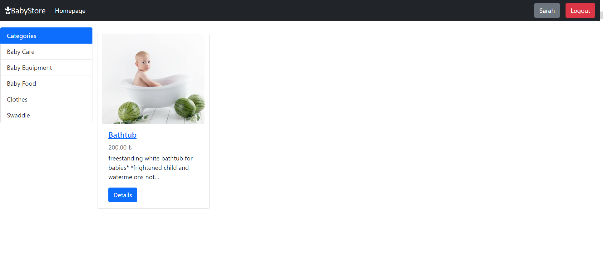
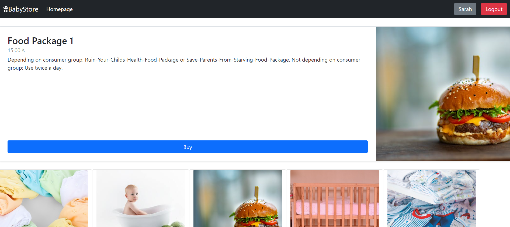
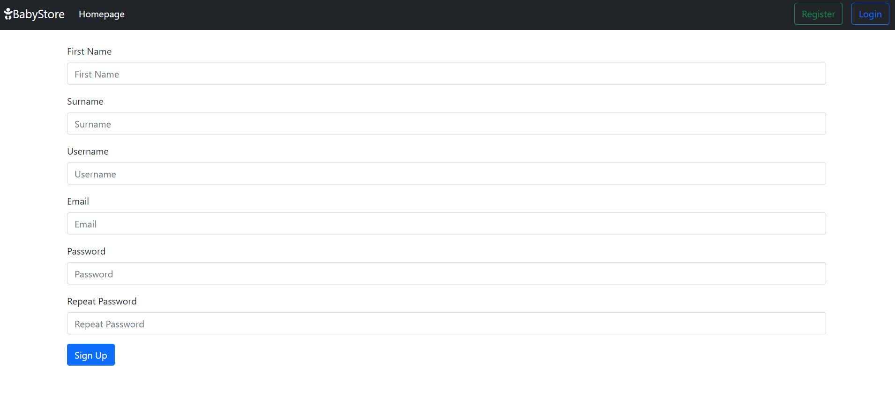
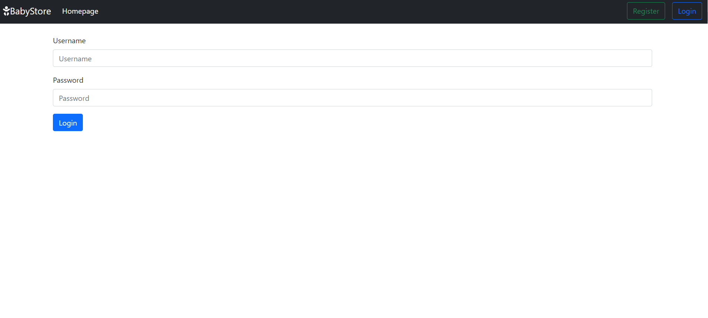

# Containerize an application using the example of a web shop: BabyStore

Here you learn **how to put a finished application - a web shop for baby tools -  into a container and publish it on a VM**. The base of this project is a **Python** app that is written with the **Django** framework. The open source platform **Docker** is used for the containerization process.  
  
This guide was created as part of my **DevSecOps training** at the Developer Akademie.

## Table of contents

1. [Technologies](#technologies)
1. [Babystore - The Baby Tools Shop](#babystore---the-baby-tools-shop)
   * [Shop Example](#shop-example)
1. [What is Containerization?](#what-is-containerization)
1. [Quickstart](#quickstart)
1. [Usage](#usage)
   * [Installation and Preparation](#installation-and-preparation)
   * [Containerization with Docker](#containerization-with-docker)

## Technologies

* **Python** 3.9
  * **Django** 5.1 [More Information](https://www.djangoproject.com/)
    * It is a **web framework** for Python that helps you develop complex websites and web applications quickly and securely.
* **Docker** 27.2.0 [More Information](https://www.docker.com/)
  * It is a platform that allows you to **isolate applications in containers** and run them reliably anywhere.

## BabyStore - The Baby Tools Shop

The application provides an **empty web shop frame** that the user can fill via the django admin panel with **categories and matching images** of baby tools that then appeares in the shop.  
  
It includes a **detail view of the products** as well as an **register and login option** for the buyers.

> [!Note]
> This project is based on an existing Django application that has been **adapted for containerization**. The **initial documentation** can be found [here](https://github.com/SarahZimmermann-Schmutzler/baby-tools-shop/commit/6f7020a99b0845e08d8259a27c886f5a7ec45bdc#diff-b335630551682c19a781afebcf4d07bf978fb1f8ac04c6bf87428ed5106870f5)

### Shop Example

#### Homepage


#### Category "Baby Care" and Logged User



#### Product Detail View



#### Register Page



#### Login Page



## What is Containerization?

There are many ways to publish an application. One way is the method of **containerization**.

* The application and its dependencies is **packed in a closed environment** called container

* This **container** can be made to run on any server, for example a virtual machine.

* To operate a container you need to install a so called container runtime. The one that is used in this project is **Docker**.

## Quickstart

This section provides a fast and **minimal setup guide** for using the tools in this repository. For a more **in-depth understanding** and additional options, please refer to the [Usage](#usage) section.

0) [Fork](https://docs.github.com/de/pull-requests/collaborating-with-pull-requests/working-with-forks/fork-a-repo) the project to your namespace, if you want to make changes or open a [Pull Request](https://docs.github.com/de/pull-requests/collaborating-with-pull-requests/proposing-changes-to-your-work-with-pull-requests/about-pull-requests).

1. [Clone](https://docs.github.com/en/repositories/creating-and-managing-repositories/cloning-a-repository) the project to your platform if you just want to use it:

    ```bash
    git clone git@github.com:SarahZimmermann-Schmutzler/baby-tools-shop.git
    ```

1. Install the container runtime **Docker** if you haven't done it already as shown [here](https://docs.docker.com/get-started/get-docker/).

1. Create an `.env-file` with the following variables:

    ```bash
    # for creating the superuser
    SUPERUSER_USERNAME=admin
    SUPERUSER_EMAIL=admin@mail.com
    SUPERUSER_PASSWORD=adminpassword
    # IP address of you VM for 
    # babyshop_app/babyshop/settings.py/ALLOWED_HOSTS
    IP_ADDRESS_VM=123.45.6.78
    ```

1. Build the **container image**:

    ```bash
    docker build -t babystore -f Dockerfile .
    ```

1. Run a **container-test** with a self removing container and have a look if the image setup is right and the application is working as it should be:

    ```bash
    docker run -it --rm -p 8025:5000 babystore
    ```

1. Start the **container with automatic restart and persistent data saving**:

    ```bash
    docker run -d \
    --name babystore-container \
    -p 8025:5000 \
    -v path/to/your/data-saving-folder:/data \
    --restart unless-stopped \
    babystore
    ```

1. **Set up the shop with products**. Then stop and start the container manually. After that have a look in the web browser if the **data is there after the restart**:

   * **Stop the container**:

      ```bash
      docker stop babystore-container
      ```

   * **Start the container**:

      ```bash
      docker start babystore-container
      ```

## Usage

### Installation and Preparation

0) [Fork](https://docs.github.com/de/pull-requests/collaborating-with-pull-requests/working-with-forks/fork-a-repo) the project to your namespace, if you want to make changes or open a [Pull Request](https://docs.github.com/de/pull-requests/collaborating-with-pull-requests/proposing-changes-to-your-work-with-pull-requests/about-pull-requests).

1. [Clone](https://docs.github.com/en/repositories/creating-and-managing-repositories/cloning-a-repository) the project to your platform if you just want to use it:

    ```bash
    git clone git@github.com:SarahZimmermann-Schmutzler/baby-tools-shop.git
    ```

1. Create an `.env-file` with the following variables:

    ```bash
    # for creating the superuser
    SUPERUSER_USERNAME=admin
    SUPERUSER_EMAIL=admin@mail.com
    SUPERUSER_PASSWORD=adminpassword
    # IP address of you VM for babyshop_app/babyshop/settings.py/ALLOWED_HOSTS
    IP_ADDRESS_VM=123.45.6.78
    ```

### Containerization with Docker

#### The Files

1. The [`Dockerfile`](./Dockerfile) the structure of a so called container-image, and thus the base of the container.

1. The associated `.dockerignore` file contains the directories that should not be copied to the container, e.g.:

    ```bash
    .gitignore
    .git/
    __pycache__/
    ```

1. To create a superuser non-interactively the app workes with the [createsupe.py](./babyshop_app/products/management/commands/createsupe.py).

#### The Use

1. Install the container runtime **Docker** if you haven't done it already as shown [here](https://docs.docker.com/get-started/get-docker/):

   * Linux/Ubuntu:

      ```bash
      sudo apt install docker.io
      ```

1. Build the **docker image**:

    ```bash
    docker build -t babystore -f Dockerfile .
    ```

    * **-t** : The tag (name) of the container-image
    * **-f Dockerfile .** : base of the docker-image is the Dockerfile from the current directory

1. Do a **test run** thats starts a container that is removed after closing and have a look if the image setup is right and the application is working as it should be:

    ```bash
    docker run -it --rm -p 8025:5000 babystore
    ```
  
    * **-it** : starts an interactive session between shell and container, so we can communicate with it
    * **--rm** : removes container after closing it
    * **-p 8025:5000** : portbinding our_server:container
    * **babystore** : reference to the container image that is named babystore

    * The container should now be accessible at: `IP_Address_VM:8025`
    * If there is an error regarding the templates, check the [`settings.py`](./babyshop_app/babyshop/settings.py) and adjust the path. Close the test container and **recreate the image after that**.

1. Does the container work, stop it with `CTL + C`and **start the container that keeps the database after restart and that restarts automatically after an error that closes the application**:

    ```bash
    docker run -d \
    --name babystore-container \
    -p 8025:5000 \
    -v path/to/your/data-saving-folder:/data \
    --restart unless-stopped \
    babystore
    ```

    * **-d** : detached mode; container runs in background
    * **--name** : you can name the container
    * **-v /home/usr/docker/babystore-data:/data** : you can save the data from the database on your host server, otherwise it will be deleted after stopping the container; `path/to/your/data-saving-folder:` path on your host server where the data is stored; `:/data` path in the container where the data is saved
    * **--restart unless-stopped** : container restarts always automatically except it is stopped manually

1. Check if the **setup works**:

    * Check if the **container is running**:  

      ```bash
      docker ps
      ```

    * Open the **admin panel** of the application in the web browser and **add some data**:

      ```bash
      http://IP-address_vm:8025/admin
      ```

    * **Stop and start the container manually** - the data should be there:

      * **Stop the container**:

        ```bash
        docker stop babystore-container
        ```

      * **Start the container**:

        ```bash
        docker start babystore-container
        ```  
